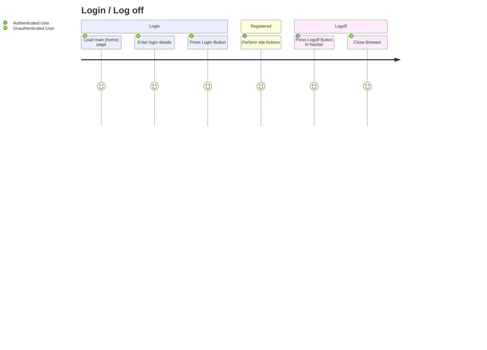
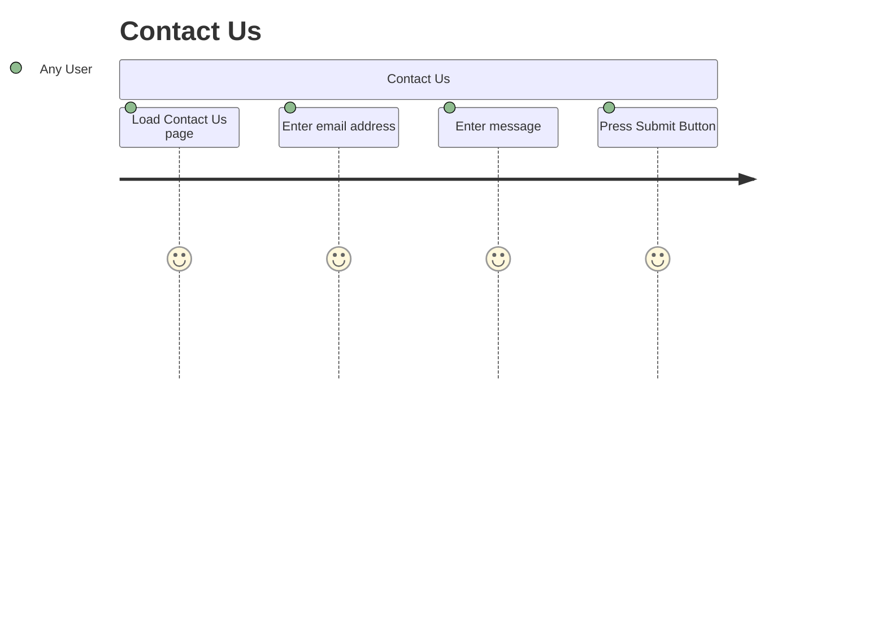

# Project Overview

This statement is referring to a website that will be selling toys that resemble McDonald's menu items like French fries, Big Macs, and McFlurrys. The toys will be designed to look like the actual food items, turning all of the McDonald's menu items into smaller, toy versions.

## User Management
This means that users will be able to access the system by logging in with a username and password, and then log out when they are finished. This is a basic security feature to ensure that only authorized users can access the system.

the information that will be stored about a user in a database.
### It includes their:
- name 
- date of birth
- email address
- physical address
- a hashed password
- their access level (whether they have admin privileges or are a normal user).

## Product Management
people who have been given the appropriate permission will be able to add, remove, and edit products in a database or system. This permission may be granted to certain individuals or groups of people, such as administrators

Product info will be stored is a statement that indicates that information related to a product will be saved in a database.
#### This information includes the product
- name+
- price
- description
- quantity (stock) of the product. 

This information is important for keeping track of the products that are available for sale.

## Behaviour User Journey 

## Planning Diagram - Wireframe
