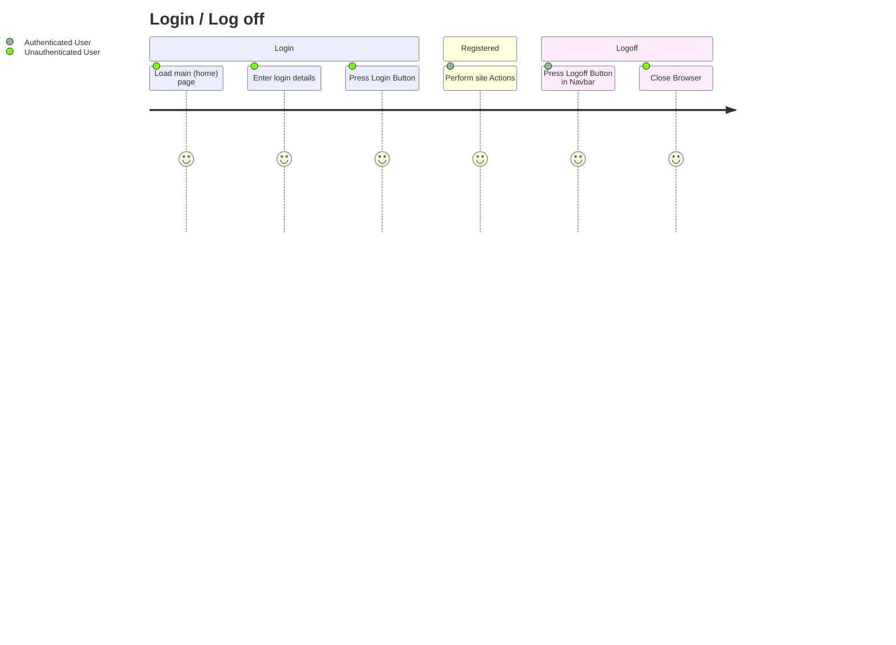
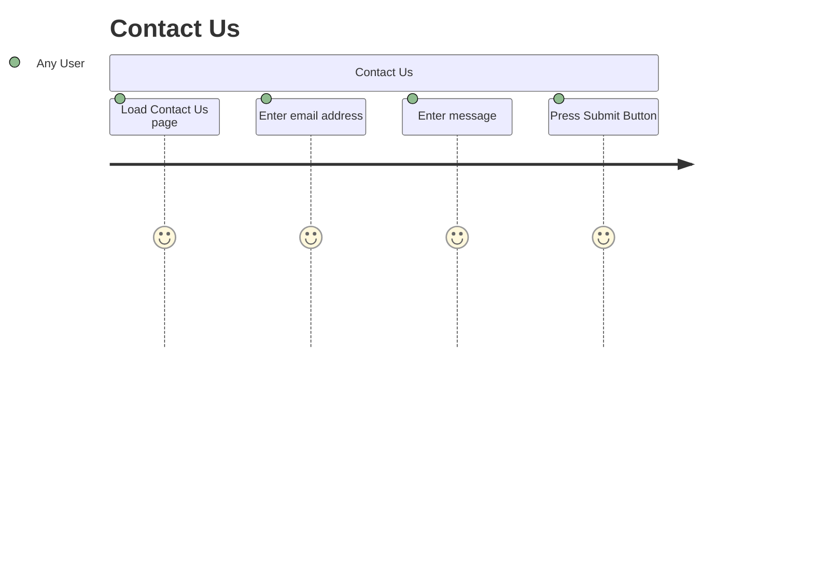
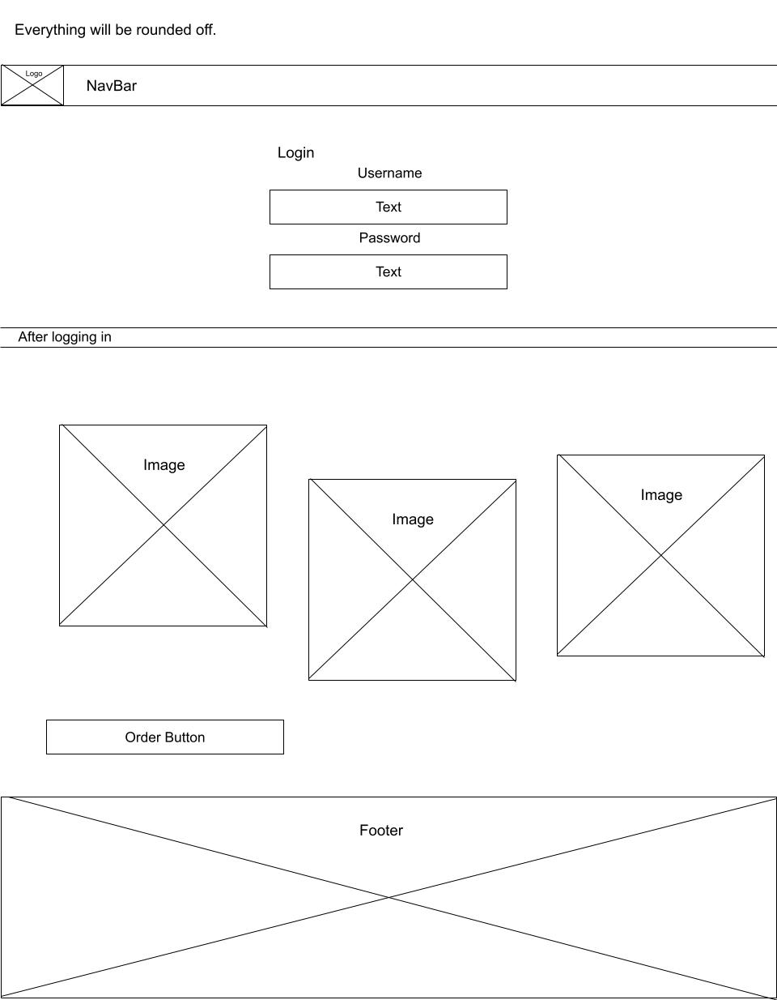
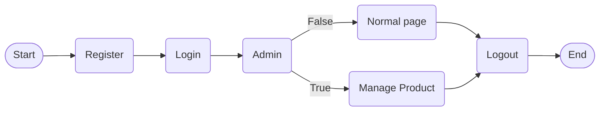

# Project Overview

My php site will be selling Maccas toys that look like Maccas foods, Chip, Big Mac McFlurrys. all foods into little foods

## User Management
Users will be able to login and out

Users info will be stored
- Name
- DOB
- Email
- Address
- hashed password
- access level (admin or normal user)

## Product Management
People with the right permission will be able to add, remove and edit Products

Product info will be stored
- Name
- Price
- Description
- Quantity (stock)

## Behaviour User Journey 

## Planning Diagram - Wireframe

## FlowChart
### User Chart
