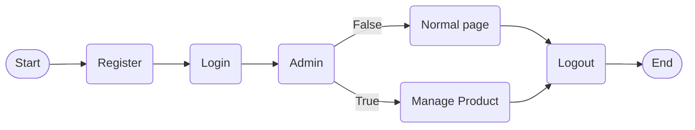
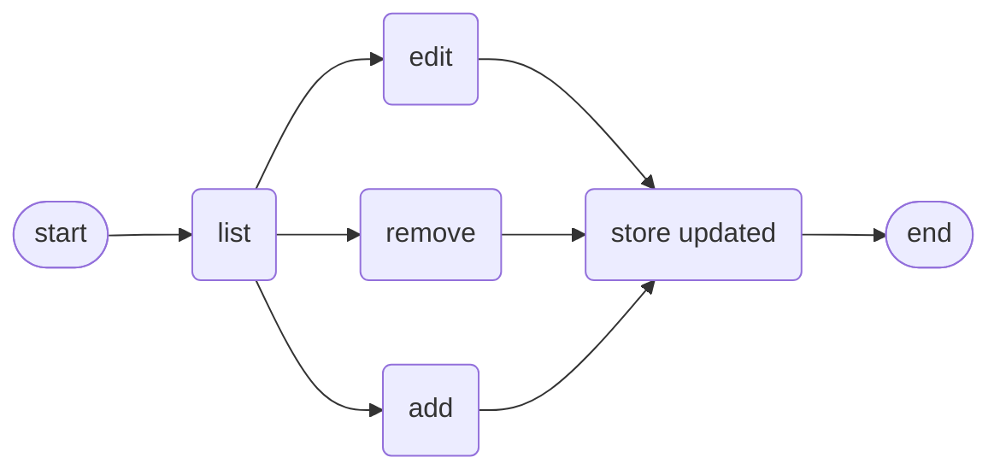
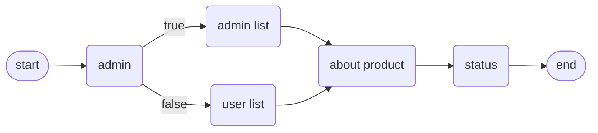
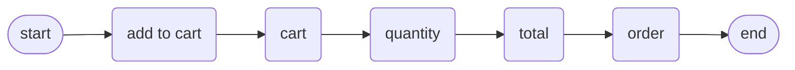

## FlowChart
### User Chart

```mermaid
flowchart LR
    terminalStart([Start])
    terminalEnd([End])
    thresholdSet(Register)
    setPiezoPin(Login)
    currentDistanceReading(Logout)
    activatePiezo(Manage Product)
    deactivatePiezo(Normal page)
    ifDistanceLessThanThreshold(Admin)
    
    terminalStart --> thresholdSet
    thresholdSet --> setPiezoPin
    setPiezoPin --> ifDistanceLessThanThreshold
    ifDistanceLessThanThreshold --> |True| activatePiezo
    ifDistanceLessThanThreshold --> |False| deactivatePiezo
    deactivatePiezo --> currentDistanceReading
    activatePiezo --> currentDistanceReading
    currentDistanceReading --> terminalEnd
```

### Product Chart

```mermaid
flowchart LR
    startTask([start])
    endTask([end])
    addProduct(add)
    editProduct(edit)
    removeProduct(remove)
    listProduct(list)
    update(store updated)
    
    startTask --> listProduct
    listProduct --> editProduct
    listProduct --> removeProduct
    listProduct --> addProduct
    editProduct --> update
    removeProduct --> update
    addProduct --> update
    update --> endTask
```

### Invoice Chat

```mermaid
flowchart LR
    startTask([start])
    endTask([end])
    admin(admin)
    adminList(admin list)
    userList(user list)
    info(about product)
    status(status)
    
    startTask --> admin
    admin --> |true| adminList
    admin --> |false| userList
    adminList --> info
    userList --> info
    info --> status
    status --> endTask
```

### Order Form/Cart

```mermaid
flowchart LR
    startTask([start])
    endTask([end])
    add(add to cart)
    cart(cart)
    quantity(quantity)
    total(total)
    order(order)
    
    startTask --> add
    add --> cart
    cart --> quantity
    quantity --> total
    total --> order
    order --> endTask
```